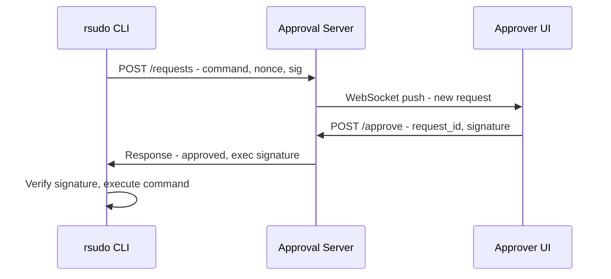

# rsudo Specification

> Remote sudo for secure command elevation with human-in-the-loop approval.

**Version**: 0.1.0 (Draft) | **Status**: Specification

---

## 1. Overview & Goals

### Core Concept

`rsudo` enables AI agents and automated systems to execute privileged commands with remote human approval. Unlike traditional `sudo`, authorization is delegated to a remote approver who can evaluate requests in real-time.

### Target Users

- **AI Agents**: LLM-based agents needing system privileges
- **Remote Administrators**: DevOps managing headless systems
- **Automated Workflows**: CI/CD requiring privileged operations

### Two Operating Modes

| Mode | Description | Use Case |
|------|-------------|----------|
| **Hanging** | Wait for approval with timeout | Interactive agent sessions |
| **SSR** | Print sign request and exit | Long async workflows, offline signing |

### Workflow Overview

```
Hanging Mode:                          SSR Mode:
Agent → rsudo reboot                   Agent → rsudo --ssr reboot
     → Server → Approver                    → Print SSR token
     ← Approval ←                           ... time passes ...
     → Execute                         Agent → rsudo --signed <token>
                                            → Execute
```

---

## 2. Architecture

### Components

```
┌───────────────┐     ┌──────────────────┐     ┌────────────────┐
│  rsudo CLI    │────▶│  Approval Server │◀────│ Approver UI    │
│  (on host)    │     │  (external)      │     │ (IDE/GTK/Web)  │
└───────────────┘     └──────────────────┘     └────────────────┘
```

| Component | Purpose |
|-----------|---------|
| **rsudo CLI** | Client on target host, requests approval, executes commands |
| **Approval Server** | Central server, routes requests, stores approvals |
| **Approver UI** | IDE plugin, GTK tray, or web dashboard for quick approve/reject |

### Communication

- **MVP Transport**: HTTP/REST (client ↔ server)
- **Approver Connection**: WebSocket for real-time push (server ↔ UI)
- **Future Transports**: gRPC, Unix socket (pluggable design)

### Data Flow - Hanging Mode



---

## 3. Security Model

### Threat Mitigations

| Threat | Mitigation |
|--------|------------|
| Unauthorized requests | Client onboarding + key registration |
| Replay attacks | Nonce + timestamp + expiration |
| MITM | TLS + message-level signatures |
| Privilege escalation | Respect local sudoers config |

### Cryptography

- **Algorithm**: Ed25519 (primary)
- **Keys**: Client keypair, Approver keypair, Server keypair

### Key Management

```bash
# Client onboarding (one-time)
rsudo init                    # Generate client keypair
rsudo register <server-url>   # Register public key with server

# Approver setup
rsudo-server approver add <pubkey>
```

### Client Onboarding

Each rsudo instance must be registered with the approval server before use. This binds:
- Client public key
- Hostname
- Allowed sudoers permissions (optional sync)

### Replay Prevention

```
Request = {command, nonce, timestamp, client_sig}
- Nonce: UUID v4 (unique per request)  
- Timestamp: Must be within ±5 min of server time
- Server caches seen nonces for 24h
```

### Sudoers Respect

rsudo must not grant more permissions than the user's local sudoers config allows. Options:
1. Execute via actual `sudo` after approval
2. Sync sudoers rules to server during onboarding

---

## 4. CLI Interface

### Primary Commands

```bash
# Execute with approval (hanging mode)
rsudo <command>
rsudo reboot
rsudo apt install nginx

# SSR mode (async)
rsudo --ssr <command>          # Output: SSR token to stdout
rsudo --signed <token>         # Execute with signed token

# Output to file
rsudo --ssr --output req.ssr <command>
```

### Management Commands

```bash
rsudo init                     # Generate client keys
rsudo register <server>        # Register with approval server
rsudo status                   # Show pending requests
rsudo config show              # Display configuration
rsudo config set <key> <val>   # Update config
```

### Options

```
-t, --timeout <SEC>    Approval timeout (default: 300)
-v, --verbose          Verbose output
-q, --quiet            Suppress output
--ssr                  SSR mode (exit with token)
--signed <TOKEN>       Execute signed request
--output <FILE>        Write SSR token to file
```

### Exit Codes

| Code | Meaning |
|------|---------|
| 0 | Command executed successfully |
| 1 | Command returned non-zero |
| 2 | Request rejected |
| 3 | Timeout |
| 4-7 | Config/network/auth errors |

---

## 5. Approval Workflow

### Request Payload

```json
{
  "request_id": "uuid",
  "command": "reboot",
  "arguments": [],
  "hostname": "server-01",
  "username": "agent",
  "timestamp": "2025-12-13T00:20:00Z",
  "expires_at": "2025-12-13T00:25:00Z",
  "nonce": "base64...",
  "client_signature": "base64..."
}
```

### Approver Interfaces (Priority Order)

1. **IDE Plugin** (VS Code, JetBrains) - Popup notification, one-click approve
2. **GTK Tray App** - System tray notifications, quick action
3. **Web Dashboard** - Fallback, full request details
4. **API** - For custom integrations

### Approver Pre-Authentication

Approver authenticates once with the server (session/token). When requests arrive:
- Push notification appears instantly
- Single click to approve/reject
- No re-authentication required

### Approval Response

```json
{
  "request_id": "uuid",
  "decision": "approved",
  "approver_pubkey": "base64...",
  "approver_signature": "base64...",
  "timestamp": "2025-12-13T00:21:00Z"
}
```

### SSR Token Format

```
-----BEGIN RSUDO REQUEST-----
Version: 1
Command: reboot
Hostname: server-01
Expires: 2025-12-14T00:00:00Z
Nonce: abc123...
Signature: def456...
-----END RSUDO REQUEST-----
```

When signed:
```
-----BEGIN RSUDO SIGNED REQUEST-----
...original fields...
Approver: ghi789...
ApproverSig: jkl012...
-----END RSUDO SIGNED REQUEST-----
```

### Timeout Handling

| Event | Time | Action |
|-------|------|--------|
| Request submitted | T+0 | Push to approver |
| Timeout | T+5min | Return error to client |

---

## 6. Configuration

### Client Config (`~/.config/rsudo/config.toml`)

```toml
[server]
url = "https://rsudo.example.com"
timeout = 30

[client]
key_file = "~/.rsudo/client.key"

[request]
default_timeout = 300
```

### Server Config (`/etc/rsudo-server/config.toml`)

```toml
[server]
bind = "0.0.0.0:8443"

[tls]
cert = "/etc/rsudo/server.crt"
key = "/etc/rsudo/server.key"

[requests]
default_timeout = 300
max_timeout = 3600

[audit]
log_file = "/var/log/rsudo/audit.log"
```

### Environment Variables

| Variable | Description |
|----------|-------------|
| `RSUDO_SERVER` | Server URL |
| `RSUDO_TIMEOUT` | Request timeout |
| `RSUDO_KEY_FILE` | Client key path |

---

## 7. Platform & Deployment

### Target Platforms

| Platform | Support |
|----------|---------|
| Linux x86_64 | Primary |
| Linux aarch64 | Primary |
| macOS | Secondary |

### Dependencies

```toml
# Key Rust dependencies
tokio = "1"           # Async runtime
reqwest = "0.11"      # HTTP client
ring = "0.17"         # Cryptography
clap = "4"            # CLI parsing
serde = "1"           # Serialization
```

### Installation

```bash
# From source
cargo install rsudo

# Binary release
curl -LO https://github.com/.../rsudo-linux-x86_64.tar.gz
tar xzf rsudo-linux-x86_64.tar.gz
sudo install -m 755 rsudo /usr/local/bin/
```

### Server Deployment

```yaml
# docker-compose.yml
services:
  rsudo-server:
    image: rsudo/server:latest
    ports:
      - "8443:8443"
    volumes:
      - ./config:/etc/rsudo-server
```

---

## 8. Error Handling

### Failure Modes

| Failure | Recovery |
|---------|----------|
| Network timeout | Retry with backoff (3 attempts) |
| Server unavailable | Clear error, suggest --ssr mode |
| Signature invalid | Re-register client |
| Request expired | User must retry |

### User Feedback

```
$ rsudo reboot

🔐 Requesting approval...
   Request: abc123
   Command: reboot
   Host: server-01

⏳ Waiting for approval (5m timeout)...

✅ Approved by: user@example.com
   Executing...
```

### Error Output

```
$ rsudo dangerous-command

❌ Request rejected
   Reason: Command not in allowed list
```

### Logging

| Level | Use |
|-------|-----|
| error | Failures only |
| info | Request lifecycle |
| debug | Protocol details |

### Audit Events

All requests logged with: request_id, command, client, approver, decision, timestamp

---

## Future Considerations

- Multi-approver quorum
- Hardware key support (FIDO2)
- Policy engine for auto-approve rules
- gRPC transport option

---

*This specification will evolve as implementation progresses.*