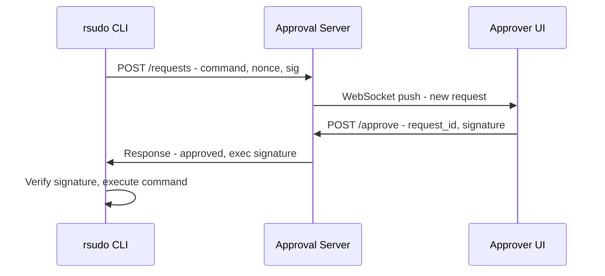

# rsudo Specification

> Remote sudo for secure command elevation with human-in-the-loop approval.

**Status**: Revised

---

## 1. Overview & Goals

### Core Concept

`rsudo` enables AI agents and automated systems to execute privileged commands with remote human approval. Unlike traditional `sudo`, authorization is delegated to a remote approver who can evaluate requests in real-time.

### Target Users

- **AI Agents**: LLM-based agents needing system privileges
- **Remote Administrators**: DevOps managing headless systems
- **Automated Workflows**: CI/CD requiring privileged operations

### Two Operating Modes

| Mode | Description | Use Case |
|------|-------------|----------|
| **Hanging** | Wait for approval with timeout | Interactive agent sessions |
| **SSR** | Print sign request and exit | Long async workflows, offline signing |

### Workflow Overview

```
Hanging Mode:                          SSR Mode:
Agent → rsudo reboot                   Agent → rsudo --ssr reboot
      → Server → Approver                    → Print SSR token
      ← Approval ←                           ... time passes ...
      → Execute                        Agent → rsudo --signed <token>
                                             → Execute
```

---

## 2. Architecture

### Components

```
┌───────────────┐     ┌──────────────────┐     ┌────────────────┐
│  rsudo CLI    │────▶│  Approval Server │◀────│ Approver UI    │
│  (on host)    │     │  (external)      │     │ (IDE/GTK/Web)  │
└───────────────┘     └──────────────────┘     └────────────────┘
```

| Component | Purpose |
|-----------|---------|
| **rsudo CLI** | Client on target host, requests approval, executes commands |
| **Approval Server** | Central server, routes requests, stores approvals |
| **Approver UI** | IDE plugin, GTK tray, or web dashboard for quick approve/reject |

### Communication

- **MVP Transport**: HTTP/REST (client ↔ server)
- **Approver Connection**: WebSocket for real-time push (server ↔ UI)
- **Future Transports**: gRPC, Unix socket (pluggable design)

### Data Flow - Hanging Mode



---

## 3. Security Model

### Threat Mitigations

| Threat | Mitigation |
|--------|------------|
| Unauthorized requests | Client enrollment + session tokens |
| Replay attacks | Nonce + timestamp + expiration |
| MITM | TLS required for all connections |
| Privilege escalation | Respect local sudoers config |
| Environment injection | Sanitize env vars when running as root |
| Forged privileged invocation | Transaction ID binding between phases |
| Token theft | Short-lived sessions + refresh tokens |

### Authentication Model

rsudo uses a **dual authentication model** to support both interactive and headless environments:

| Mode | Use Case | Flow |
|------|----------|------|
| **Interactive** | Developer workstations, AI agents with browser access | OAuth 2.0 Device Code Flow |
| **Batch** | Containers, CI/CD, headless VMs | Pre-shared enrollment tokens |

#### Interactive Mode (OAuth/OIDC)

For environments where a user can access a browser:

```
rsudoctl login
  → Display device code + verification URL
  → User visits URL in browser
  → User authenticates with IdP (Google, GitHub, Okta, etc.)
  → Client polls for completion
  → Receives session token + refresh token
  → Session stored in ~/.cache/rsudo/session.json
```

**Benefits:**
- No key management for end users
- Leverages existing identity providers
- Works well with AI agents (device code flow is non-interactive after initial setup)
- Session tokens can be refreshed automatically

**Session management:**
- Access token: 1 hour expiry (configurable)
- Refresh token: 30 days expiry (configurable)
- Auto-refresh when access token expires
- `rsudoctl logout` invalidates all tokens

#### Batch Mode (Enrollment Tokens)

For headless environments (containers, CI/CD):

```
# Via Web UI or API - create token with validation rules:
POST /api/tokens
{
  "uses": 5,
  "expires_in": "24h",
  "rules": {
    "hostname_pattern": "prod-worker-*",
    "ip_ranges": ["10.0.0.0/8"],
    "required_env": {"K8S_NAMESPACE": "production"}
  }
}
  → Returns: {"token": "rt_abc123...", "uses_remaining": 5}

# On target machine - via argument:
rsudoctl login --token rt_abc123...

# Or via environment variable (preferred for containers):
export RSUDO_ENROLL_TOKEN=rt_abc123...
rsudoctl login --token

  → Client fetches token rules from server
  → Validates local environment against rules
  → If valid: exchanges token for session credentials
  → Token use count decremented
  → Session stored locally
```

**Token precedence:** `--token` argument > `RSUDO_ENROLL_TOKEN` env var

**Enrollment token properties:**
- Cryptographically random (32 bytes, base62 encoded)
- Limited number of uses (default: 1, max: 100)
- Time-limited (default: 24h, max: 30d)
- Validation rules checked client-side during enrollment
- Can be revoked via Web UI or API before expiration

**Token format:** `rt_<base62_random>` (e.g., `rt_7kB9xMn2pQrS4tUv`)

**Validation rules (checked by rsudo-cli):**

| Rule | Description | Example |
|------|-------------|---------|
| `hostname_pattern` | Glob pattern for allowed hostnames | `prod-*`, `*.example.com` |
| `ip_ranges` | CIDR ranges for client IP | `["10.0.0.0/8", "192.168.1.0/24"]` |
| `required_env` | Environment variables that must match | `{"CI": "true", "BRANCH": "main"}` |
| `env_pattern` | Env var matching with glob/regex | `{"AWS_REGION": "us-*"}` |

**Validation flow:**
```
rsudoctl login --token rt_abc123
  → GET /api/tokens/rt_abc123/rules (unauthenticated, rate-limited)
  → Server returns validation rules (but not full token details)
  → Client checks: hostname, IP, env vars
  → If any rule fails: error with specific reason
  → If all pass: POST /api/enroll with token + machine info
  → Server validates token, creates session
```

### Privilege Execution

rsudo uses `sudo` with `NOPASSWD` for privilege escalation. The binary runs unprivileged for approval, then re-invokes itself with elevated privileges to execute the approved command.

**Two-Phase Execution:**

```
Phase 1 (unprivileged):          Phase 2 (privileged):
rsudo reboot                     RSUDO_TXN=<id> sudo rsudo reboot
  → Request approval               → Detect RSUDO_TXN env var
  → Receive signed approval        → Lookup transaction by RSUDO_TXN
  → Store approval + transaction   → Verify command matches approval
  → Exec with RSUDO_TXN env var    → Re-validate approval signature
                                   → Execute target command as root
```

**Re-invocation rationale**: The unprivileged phase handles network I/O and cryptographic validation without root access. Only after approval is verified does rsudo escalate privileges via sudo for actual command execution.

**Command in re-invocation**: The actual command is passed to the privileged phase for audit visibility (appears in logs, `ps`, etc.). rsudo verifies the command matches the approved transaction before execution.

**Phase detection**: Presence of `RSUDO_TXN` env var indicates privileged phase. Transaction details (including original user) are retrieved from stored approval data.

**Transaction ID**: A cryptographically random ID passed via `RSUDO_TXN` env var binds the two phases. The unprivileged phase stores the approval with this ID; the privileged phase retrieves and re-validates it. This prevents attackers from forging privileged invocations.

**Sudoers configuration** (`/etc/sudoers.d/rsudo`):

```bash
# RHEL/Fedora/CentOS (wheel group)
%wheel ALL=(ALL) NOPASSWD: /usr/bin/rsudo

# Debian/Ubuntu (sudo group)
%sudo ALL=(ALL) NOPASSWD: /usr/bin/rsudo
```

**Security guarantees:**
- Approval signature re-validated in privileged phase (prevents TOCTOU attacks)
- Environment variables sanitized before executing target command
- Audit logging to `/var/log/rsudo/audit.log` and syslog

### Cryptography & Key Usage

- **Algorithm**: Ed25519

**Key purposes (clarified):**

| Key | Owner | Purpose |
|-----|-------|---------|
| **Server keypair** | Approval server | Signs approval responses for non-repudiation |
| **Approver keypair** | Human approver | Signs individual approval decisions |

**Note:** Clients do NOT have Ed25519 keys. Client authentication is handled via OAuth sessions or enrollment tokens. This eliminates key management burden on client machines.

**Approval signature chain:**
```
Request approved → Approver signs with their key → Server co-signs → Client verifies both
```

### Client Onboarding

Each rsudo client must be enrolled with the approval server before use. Enrollment binds:

- **Client identity** (from OAuth or enrollment token)
- **Machine hostname**
- **Approver assignments** (which approvers can approve this client's requests)

**First-run experience:**

```bash
# Interactive (developer workstation):
$ rsudo reboot
Error: Not enrolled. Run 'rsudoctl login' first.

$ rsudoctl login
Visit: https://rsudo.example.com/device
Enter code: ABCD-1234
Waiting for authorization... ✓
Enrolled as: user@example.com (host: dev-laptop)

$ rsudo reboot
🔐 Requesting approval...

# Batch (container):
$ rsudoctl login --token
Enrolled as: service-account (host: container-abc123)

$ rsudo reboot
🔐 Requesting approval...
```

### Machine ID Generation

| Platform | Source |
|----------|--------|
| Linux | `/etc/machine-id` (systemd) |
| macOS | `IOPlatformUUID` from IOKit |
| Windows | `MachineGuid` from registry |
| Fallback | Generated UUID persisted to `~/.cache/rsudo/machine_id` |

### Approver Authorization

The server maintains a mapping of which approvers can approve requests from which machine groups (configurable via Web UI or API):

| Setting | Description |
|---------|-------------|
| `approver` | User identity (email) |
| `machine_groups` | List of machine groups this approver can approve |

Approvers must also be enrolled via OAuth before they can approve requests.

**Example:**
```json
// Assign approver to machine groups
POST /api/orgs/acme-corp/approvers
{
  "user": "admin@acme-corp.com",
  "machine_groups": ["*"]  // Can approve all groups in org
}

POST /api/orgs/acme-corp/approvers
{
  "user": "dev-lead@acme-corp.com",
  "machine_groups": ["dev-boxes", "staging-servers"]
}
```

### Multi-Tenant Policies

For community servers (e.g., rsudo.dev), policies are applied to **machine groups** which can be either **personal** (user-owned) or **organization-wide**. All settings are configured via Web UI or API.

**Session & Token Policies (User/Org level):**

| Policy | Default | Description |
|--------|---------|-------------|
| `session.access_token_ttl` | 1h | Access token lifetime |
| `session.refresh_token_ttl` | 30d | Refresh token lifetime |
| `enrollment.max_uses` | 100 | Max uses per enrollment token |
| `enrollment.max_ttl` | 30d | Max lifetime for enrollment tokens |
| `enrollment.default_ttl` | 24h | Default token lifetime |

**Machine Groups:**

Policies are applied to **machine groups** with dynamic membership rules. Machines are automatically assigned to groups based on their properties at enrollment time.

- **Personal groups:** Owned by a user, for their own machines
- **Organization groups:** Shared across an organization, managed by org admins

| Group Rule | Description | Example |
|------------|-------------|---------|
| `hostname_pattern` | Glob pattern for hostnames | `prod-*`, `*.us-east.example.com` |
| `ip_ranges` | CIDR ranges for machine IP | `["10.0.0.0/8", "192.168.1.0/24"]` |
| `env_pattern` | Environment variables matching | `{"K8S_CLUSTER": "prod-*"}` |
| `labels` | Key-value labels set during enrollment | `{"environment": "production"}` |

**Machine Group Policies:**

| Policy | Default | Description |
|--------|---------|-------------|
| `request.timeout` | 300s | Default approval timeout |
| `request.max_timeout` | 3600s | Maximum allowed timeout |
| `commands.allowed` | `["*"]` | Allowed command patterns |
| `commands.denied` | `[]` | Denied command patterns (takes precedence) |

**Ownership:**
- Machine groups can belong to a **user** (personal) or an **organization** (shared)
- A machine can match multiple groups; policies merge (most restrictive wins for security)

**Policy Inheritance:**

```
Global defaults → Organization → Machine Group → (merged if multiple groups)
                  (later overrides earlier)
```

**Example via API:**

```json
// Create a machine group for production workers
POST /api/orgs/acme-corp/groups
{
  "name": "production-workers",
  "rules": {
    "hostname_pattern": "prod-worker-*",
    "ip_ranges": ["10.100.0.0/16"],
    "env_pattern": {"ENVIRONMENT": "production"}
  },
  "policies": {
    "request": {"timeout": 600, "max_timeout": 1800},
    "commands": {
      "allowed": ["systemctl restart *", "apt update", "docker *"],
      "denied": ["rm -rf *", "shutdown"]
    }
  }
}

// Create a personal machine group
POST /api/users/alice/groups
{
  "name": "my-dev-boxes",
  "rules": {"hostname_pattern": "alice-dev-*"},
  "policies": {"request": {"timeout": 120}}
}
```

**Group Assignment Flow:**
```
Machine enrolls → Server evaluates all group rules → Assigns matching groups → Merges policies
                  (re-evaluated on each request if machine properties change)
```

### Replay Prevention

```
Request = {command, nonce, timestamp, session_token}
- Nonce: UUID v4 (unique per request)
- Timestamp: Must be within ±5 min of server time
- Server caches seen nonces for 24h
```

### Sudoers Respect

rsudo must not grant more permissions than the user's local sudoers config allows. Options:
1. Execute via actual `sudo` after approval
2. Sync sudoers rules to server during onboarding

---

## 4. CLI Interface

### Dual-Binary Design

rsudo uses a **dual-binary design** to cleanly separate command execution from management operations. Both binaries are the **same executable** with behavior determined by `argv[0]`:

| Binary | Purpose | Example |
|--------|---------|---------|
| `rsudo` | Execute commands with approval | `rsudo reboot` |
| `rsudoctl` | Manage enrollment, sessions, config | `rsudoctl login` |

This design prevents conflicts with OS binaries (e.g., `rsudo status` executes `/usr/bin/status`, while `rsudoctl status` shows rsudo enrollment status).

**Implementation:** Packages install a single binary and create `rsudoctl` as a symlink or hardlink:
```bash
/usr/bin/rsudo           # Primary binary
/usr/bin/rsudoctl → rsudo  # Symlink (or hardlink)
```

The binary detects its invocation name via `std::env::args().next()` and routes to the appropriate command set.

### Command Execution (`rsudo`)

```bash
# Execute with approval (hanging mode)
rsudo <command>
rsudo reboot
rsudo apt install nginx

# SSR mode (async)
rsudo --ssr <command>          # Output: SSR token to stdout
rsudo --signed <token>         # Execute with signed token

# Output to file
rsudo --ssr --output req.ssr <command>
```

### Management Commands (`rsudoctl`)

```bash
# Interactive login (OAuth device flow)
rsudoctl login                 # Opens browser, authenticates with IdP

# Batch enrollment (headless) - requires --token flag
rsudoctl login --token <token> # Uses provided enrollment token
rsudoctl login --token         # Uses RSUDO_ENROLL_TOKEN env var (fails if not set)

# Session management
rsudoctl logout                # Invalidate session, remove local tokens
rsudoctl status                # Show enrollment status, identity, session expiry

# Configuration
rsudoctl config show           # Display configuration
rsudoctl config set <key> <val> # Update config (user-level only)
```

**Login mode selection:**
- `--token` flag explicitly selects batch enrollment mode
- Token value: from argument, or from `RSUDO_ENROLL_TOKEN` env var if argument omitted
- Without `--token` → interactive OAuth device flow

**Note:** Server URL is configured at system level (`/etc/rsudo/config.toml`) only and cannot be overridden by users for security reasons.

### rsudo Options

```
-t, --timeout <SEC>    Approval timeout (default: 300)
-v, --verbose          Verbose output
-q, --quiet            Suppress output
--ssr                  SSR mode (exit with token)
--signed <TOKEN>       Execute signed request
--output <FILE>        Write SSR token to file
```

### Exit Codes

| Code | Meaning |
|------|---------|
| 0 | Command executed successfully |
| 1 | Command returned non-zero |
| 2 | Request rejected |
| 3 | Timeout |
| 4 | Configuration error |
| 5 | Network error |
| 6 | Authentication error (not enrolled, session expired) |
| 7 | Enrollment validation failed |

---

## 5. Approval Workflow

### Request Payload

```json
{
  "request_id": "uuid",
  "command": "reboot",
  "arguments": [],
  "hostname": "server-01",
  "username": "agent",
  "timestamp": "2025-12-13T00:20:00Z",
  "expires_at": "2025-12-13T00:25:00Z",
  "nonce": "base64...",
  "client_signature": "base64..."
}
```

### Approver Interfaces (Priority Order)

1. **IDE Plugin** (VS Code, JetBrains) - Popup notification, one-click approve
2. **Desktop App** (`rsudo-approver`) - GTK4 tray app with system notifications
3. **Web Dashboard** - Browser-based with Web Push Notifications
4. **API** - For custom integrations

### Notification Channel Priority

Approvers can register multiple notification channels. The server routes notifications based on priority to avoid duplicate alerts:

| Priority | Channel | Condition |
|----------|---------|-----------|
| 1 | IDE Plugin | Active WebSocket connection from plugin |
| 2 | Desktop App | Active WebSocket connection from app |
| 3 | Web Push | Registered subscription, no active app/plugin |

**Behavior:**
- Server tracks active connections per approver
- When request arrives, server checks highest-priority active channel
- Only one channel receives notification (no duplicates)
- If preferred channel disconnects, fallback to next priority
- Approver can configure preferences via Web UI (e.g., prefer desktop app over IDE)

### Web Push Notifications

The web dashboard supports browser push notifications for approvers who don't have IDE plugins or desktop apps installed. Notifications arrive even when the browser is completely closed - the OS maintains a background connection to the push service.

**Flow:**
1. Approver visits dashboard, grants notification permission
2. Browser registers Service Worker, subscribes to push
3. When request arrives, server sends push via VAPID
4. OS displays system notification (browser can be closed)
5. Clicking notification opens approval page
6. Single click to approve/reject

**Requirements:**
- Service Worker for background notification handling
- VAPID keys for push subscription authentication
- User grants notification permission on first visit
- Works on desktop browsers (Chrome, Firefox, Edge, Safari)

**Notification content tiers:**

| Tier | Content | Default |
|------|---------|---------|
| Minimal | "New rsudo request pending" | ✓ |
| Partial | "Request from [hostname]" | |
| Full | Command, user, hostname (E2E encrypted) | |

Approvers configure via Web UI: Profile → Notification Preferences

### Approver Pre-Authentication

Approver authenticates once with the server (session/token). When requests arrive:
- Push notification appears instantly
- Single click to approve/reject
- No re-authentication required

### Approval Response

```json
{
  "request_id": "uuid",
  "decision": "approved",
  "approver_pubkey": "base64...",
  "approver_signature": "base64...",
  "timestamp": "2025-12-13T00:21:00Z"
}
```

### SSR Token Format

```
-----BEGIN RSUDO REQUEST-----
Version: 1
Command: reboot
Hostname: server-01
Expires: 2025-12-14T00:00:00Z
Nonce: abc123...
Signature: def456...
-----END RSUDO REQUEST-----
```

When signed:
```
-----BEGIN RSUDO SIGNED REQUEST-----
...original fields...
Approver: ghi789...
ApproverSig: jkl012...
-----END RSUDO SIGNED REQUEST-----
```

### Timeout Handling

| Event | Time | Action |
|-------|------|--------|
| Request submitted | T+0 | Push to approver |
| Timeout | T+5min | Return error to client |

---

## 6. Configuration

### Configuration Model

rsudo uses layered configuration with three sources:

| Config | Location | Purpose | Permissions |
|--------|----------|---------|-------------|
| **System** | `/etc/rsudo/config.toml` | Server URL, CA certs, policy, audit | `root:root 644` |
| **Drop-in** | `/etc/rsudo.d/*.toml` | Additional system config (automation-friendly) | `root:root 644` |
| **User** | `~/.config/rsudo/config.toml` | Client keys, personal preferences | User-owned |

**Merging order** (later overrides earlier):
1. `/etc/rsudo/config.toml` (base)
2. `/etc/rsudo.d/*.toml` (alphabetical order)
3. `~/.config/rsudo/config.toml` (user)

**Merging rules:**
- System config provides defaults
- Drop-in configs extend/override system settings (useful for config management tools)
- User config can override non-security settings
- **Security-critical fields** (server URL, policy, CA certs) cannot be overridden by user config

### System Config (`/etc/rsudo/config.toml`)

```toml
[server]
url = "https://rsudo.example.com"    # Cannot be overridden
ca_cert = "/etc/rsudo/ca.crt"

[policy]
allowed_commands = ["*"]             # Cannot be overridden
require_tty = false

[audit]
log_file = "/var/log/rsudo/audit.log"
syslog = true
```

### User Config (`~/.config/rsudo/config.toml`)

```toml
[request]
default_timeout = 300
```

### Session Storage (`~/.cache/rsudo/`)

Session credentials are stored in the cache directory (managed by `rsudoctl login`/`rsudoctl logout`):

| File | Purpose |
|------|---------|
| `session.json` | Access token, refresh token, expiry times |
| `machine_id` | Stable machine identifier for this enrollment |

### Server Config (`/etc/rsudo/server.toml`)

```toml
[server]
bind = "0.0.0.0:8443"

[tls]
cert = "/etc/rsudo/server.crt"
key = "/etc/rsudo/server.key"

[oauth]
# OAuth/OIDC provider configuration
issuer = "https://accounts.google.com"
client_id = "rsudo-client-id"
client_secret_file = "/etc/rsudo/oauth-secret"
# Or use environment variable: RSUDO_OAUTH_CLIENT_SECRET

[session]
access_token_ttl = "1h"
refresh_token_ttl = "30d"

[enrollment]
max_token_uses = 100
max_token_ttl = "30d"

[requests]
default_timeout = 300
max_timeout = 3600

[audit]
log_file = "/var/log/rsudo/audit.log"
```

### Environment Variables

| Variable | Description |
|----------|-------------|
| `RSUDO_TIMEOUT` | Request timeout (client) |
| `RSUDO_ENROLL_TOKEN` | Enrollment token for batch mode (client) |
| `RSUDO_OAUTH_CLIENT_SECRET` | OAuth client secret (server) |

---

## 7. Platform & Deployment

### Target Platforms

| Platform | Support |
|----------|---------|
| Linux x86_64 | Primary |
| Linux aarch64 | Primary |
| macOS | Secondary |

### Dependencies

```toml
# Key Rust dependencies
tokio = "1"           # Async runtime
reqwest = "0.11"      # HTTP client
ring = "0.17"         # Cryptography
clap = "4"            # CLI parsing
serde = "1"           # Serialization
```

### Installation

```bash
# From source
cargo install rsudo
# Then create symlink manually:
sudo ln -s /usr/bin/rsudo /usr/bin/rsudoctl

# Debian/Ubuntu
sudo apt install ./rsudo_*.deb

# RHEL/Fedora/CentOS
sudo dnf install ./rsudo-*.rpm

# Alpine Linux
sudo apk add ./rsudo-*.apk

# Arch Linux (AUR)
yay -S rsudo

# Nix
nix profile install nixpkgs#rsudo

# macOS (Homebrew)
brew install rsudo/tap/rsudo
```

Packages handle:
- Binary installation to `/usr/bin/rsudo` (Linux) or package-specific prefix with correct ownership
- Symlink or hardlink: `/usr/bin/rsudoctl` → `/usr/bin/rsudo`
- Sudoers configuration in `/etc/sudoers.d/rsudo`
- System config directory `/etc/rsudo/` and drop-in `/etc/rsudo.d/`
- Audit log directory `/var/log/rsudo/`

### Server Deployment

```yaml
# docker-compose.yml
services:
  rsudo-server:
    image: rsudo/server:latest
    ports:
      - "8443:8443"
    volumes:
      - ./config:/etc/rsudo-server
```

---

## 8. Error Handling

### Failure Modes

| Failure | Recovery |
|---------|----------|
| Network timeout | Retry with backoff (3 attempts) |
| Server unavailable | Clear error, suggest --ssr mode |
| Signature invalid | Re-register client |
| Request expired | User must retry |

### User Feedback

```
$ rsudo reboot

🔐 Requesting approval...
   Request: abc123
   Command: reboot
   Host: server-01

⏳ Waiting for approval (5m timeout)...

✅ Approved by: user@example.com
   Executing...
```

### Error Output

```
$ rsudo dangerous-command

❌ Request rejected
   Reason: Command not in allowed list
```

### Logging

| Level | Use |
|-------|-----|
| error | Failures only |
| info | Request lifecycle |
| debug | Protocol details |

### Audit Events

All requests logged with: request_id, command, client, approver, decision, timestamp

---

## Future Considerations

- Multi-approver quorum
- Hardware key support (FIDO2)
- Policy engine for auto-approve rules
- gRPC transport option

---

*This specification will evolve as implementation progresses.*